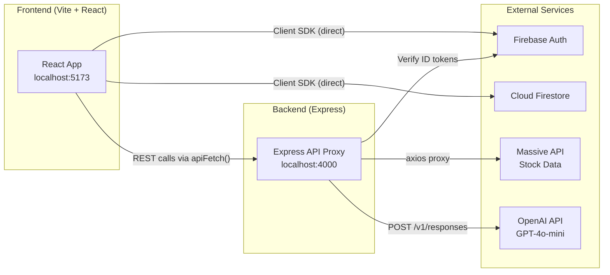
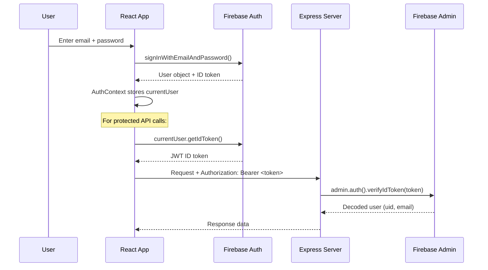
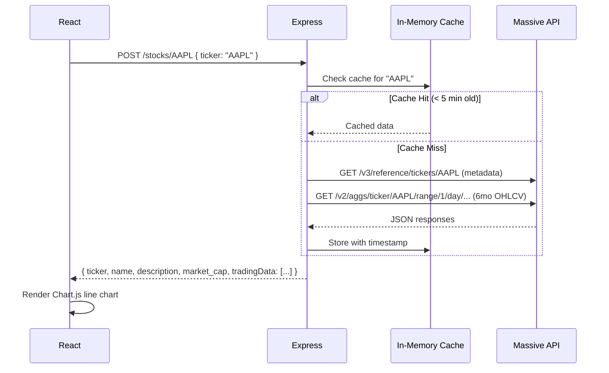
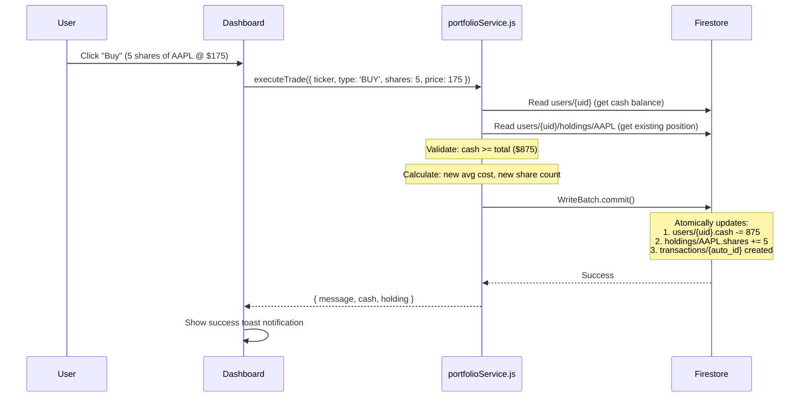

# Currensee — Systems & Architecture Overview

> Developer onboarding guide covering every major system in the Currensee platform.

---

## Table of Contents

1. [High-Level Architecture](#high-level-architecture)
2. [Project Structure](#project-structure)
3. [Frontend Stack](#frontend-stack)
4. [Backend Stack](#backend-stack)
5. [Authentication System](#authentication-system)
6. [Database — Firestore](#database--firestore)
7. [Stock Market Data Pipeline](#stock-market-data-pipeline)
8. [AI Assistant System](#ai-assistant-system)
9. [Portfolio & Trading Engine](#portfolio--trading-engine)
10. [Design System & CSS Architecture](#design-system--css-architecture)
11. [Environment Variables](#environment-variables)
12. [Running the Project](#running-the-project)

---

## High-Level Architecture



> **Key insight**: Firestore reads/writes happen **directly from the client** via the Firebase JS SDK (no server intermediary for portfolio data). The Express server exists purely as: (1) a secure proxy to the Massive stock API, (2) the AI chat endpoint, and (3) a token verifier for protected routes.

---

## Project Structure

```
Investor App/
├── .env                          # All environment variables (both server & client VITE_ vars)
├── package.json                  # Root — npm scripts, server dependencies
│
├── client/                       # Frontend (Vite + React SPA)
│   ├── package.json              # Client dependencies (React, Firebase, Chart.js)
│   ├── vite.config.js
│   ├── index.html
│   ├── public/                   # Static assets (logo, favicon)
│   └── src/
│       ├── main.jsx              # Entry point — wraps App in BrowserRouter + AuthProvider
│       ├── App.jsx               # Root component — layout, routes, ToastProvider
│       ├── firebase.js           # Firebase client SDK init (Auth + Firestore)
│       ├── index.css             # CSS import chain entry
│       │
│       ├── contexts/
│       │   ├── AuthContext.jsx    # React context for current user state
│       │   └── ToastContext.jsx   # Global toast notification system
│       │
│       ├── components/
│       │   ├── Navbar.jsx        # Top navigation bar
│       │   ├── Footer.jsx        # Site footer
│       │   ├── AuthGuard.jsx     # Route protection (redirects to /auth if unauthenticated)
│       │   └── TickerTape.jsx    # Live scrolling stock prices
│       │
│       ├── hooks/
│       │   └── useApi.js         # apiFetch() — authenticated fetch wrapper
│       │
│       ├── services/
│       │   └── portfolioService.js  # Firestore CRUD for portfolios (client-side)
│       │
│       ├── pages/
│       │   ├── Home.jsx          # Landing page with hero, stats, feature cards, charts
│       │   ├── Auth.jsx          # Login / Sign Up
│       │   ├── Dashboard.jsx     # Stock search + chart + trading panel
│       │   ├── Portfolio.jsx     # Holdings table + allocation chart
│       │   ├── OptionsCenter.jsx # Educational content + calculator
│       │   ├── OptionsPlayground.jsx  # Simulated options chain
│       │   └── AskAI.jsx        # AI chat interface
│       │
│       └── styles/               # Design system (all vanilla CSS)
│           ├── tokens.css        # Color palette, spacing, radii, transitions
│           ├── base.css          # Global resets, typography
│           ├── animations.css    # Keyframe animations, entrance effects
│           ├── topbar.css        # Navbar-specific styles
│           ├── components.css    # Reusable component styles
│           └── pages.css         # Page-specific layout styles
│
└── server/                       # Backend (Express API)
    ├── server.js                 # App bootstrap, middleware, route mounting
    ├── firebase-admin.js         # Firebase Admin SDK init (for token verification)
    │
    ├── middleware/
    │   └── authToken.js          # requireAuth — verifies Firebase ID tokens
    │
    ├── routes/
    │   ├── stocks.js             # /stocks/* routes
    │   ├── portfolio.js          # /portfolio/* routes
    │   └── aiRoute.js            # /api/ai/* routes
    │
    ├── controllers/
    │   ├── stockController.js    # Massive API proxy + in-memory cache
    │   └── portfolioController.js # (server-side portfolio endpoints)
    │
    └── services/                 # Shared business logic
```

---

## Frontend Stack

| Technology | Version | Purpose |
|-----------|---------|---------|
| **React** | 18.3 | UI framework |
| **Vite** | 5.2+ | Dev server & build tool |
| **React Router** | 6.22 | Client-side routing (7 routes) |
| **Firebase JS SDK** | 10.10 | Auth (client-side) + Firestore (direct reads/writes) |
| **Chart.js** | 4.5 | Stock price charts & allocation doughnut |

### Routing

All routes are defined in [App.jsx](file:///Users/theoh/Documents/Development/Investor%20App/client/src/App.jsx):

| Route | Component | Auth Required? |
|-------|-----------|---------------|
| `/` | `Home` | No |
| `/auth` | `Auth` | No |
| `/dashboard` | `Dashboard` | ✅ via `AuthGuard` |
| `/portfolio` | `Portfolio` | ✅ via `AuthGuard` |
| `/options-center` | `OptionsCenter` | ✅ via `AuthGuard` |
| `/options-playground` | `OptionsPlayground` | ✅ via `AuthGuard` |
| `/ask` | `AskAI` | ✅ via `AuthGuard` |

### The `apiFetch()` Helper

All calls to the Express backend go through [useApi.js](file:///Users/theoh/Documents/Development/Investor%20App/client/src/hooks/useApi.js). It automatically attaches the Firebase ID token:

```js
const res = await apiFetch('/stocks/AAPL', {
  method: 'POST',
  body: JSON.stringify({ ticker: 'AAPL' }),
});
```

---

## Backend Stack

| Technology | Version | Purpose |
|-----------|---------|---------|
| **Express** | 5.1 | HTTP framework |
| **Firebase Admin SDK** | 13.7 | Token verification on protected routes |
| **Helmet** | 8.1 | Security headers |
| **express-rate-limit** | 8.3 | Global rate limiter (100 req/15 min per IP) |
| **Axios** | 1.11 | HTTP client for external API calls |
| **Nodemon** | 3.1 | Dev auto-restart |

### Middleware Pipeline

```
Request → express.json() → CORS → Helmet → Rate Limiter → Route Handler
```

### API Endpoints

| Method | Path | Auth? | Purpose |
|--------|------|-------|---------|
| `POST` | `/stocks/:ticker` | No | Fetch stock data from Massive API (cached) |
| `GET` | `/stocks/logo/:ticker` | No | Proxy stock logo image |
| `GET` | `/stocks/all` | ✅ | List all stocks (placeholder) |
| `GET` | `/portfolio/` | ✅ | Get user portfolio |
| `POST` | `/portfolio/trade` | ✅ | Execute buy/sell trade |
| `GET` | `/portfolio/transactions` | ✅ | Get transaction history |
| `POST` | `/api/ai/ask` | ✅ | AI chat completion |
| `GET` | `/api/ai/health` | No | AI system status check |

---

## Authentication System

### How It Works



### Key Files

| File | Role |
|------|------|
| [firebase.js](file:///Users/theoh/Documents/Development/Investor%20App/client/src/firebase.js) | Client-side Firebase init (Auth + Firestore instances) |
| [AuthContext.jsx](file:///Users/theoh/Documents/Development/Investor%20App/client/src/contexts/AuthContext.jsx) | React context — listens to `onAuthStateChanged`, provides `currentUser` |
| [AuthGuard.jsx](file:///Users/theoh/Documents/Development/Investor%20App/client/src/components/AuthGuard.jsx) | Route wrapper — redirects to `/auth` if not logged in |
| [Auth.jsx](file:///Users/theoh/Documents/Development/Investor%20App/client/src/pages/Auth.jsx) | Login/signup form — calls `signInWithEmailAndPassword` / `createUserWithEmailAndPassword` |
| [firebase-admin.js](file:///Users/theoh/Documents/Development/Investor%20App/server/firebase-admin.js) | Server-side Admin SDK init (for verifying tokens) |
| [authToken.js](file:///Users/theoh/Documents/Development/Investor%20App/server/middleware/authToken.js) | Express middleware — extracts Bearer token, verifies, attaches `req.user` |

### Where Users Are Stored

- **Firebase Authentication** manages user accounts (email, password hashing, tokens)
- **Cloud Firestore** stores user application data (portfolio, cash balance, trades) under `users/{uid}`
- There is **no custom user table** — Firebase Auth IS the user store

### Creating a New User

1. User fills out the Sign Up form in `Auth.jsx`
2. `createUserWithEmailAndPassword(auth, email, password)` is called (Firebase client SDK)
3. Firebase creates the user account and returns a `User` object
4. On first portfolio access, `ensureUserDoc()` in `portfolioService.js` creates a Firestore doc at `users/{uid}` with `{ cash: 100000, createdAt: timestamp }`

---

## Database — Firestore

### Data Model

```
Firestore
└── users (collection)
    └── {uid} (document)
        ├── cash: 100000             (number)
        ├── createdAt: Timestamp
        │
        ├── holdings (subcollection)
        │   └── {TICKER} (document)
        │       ├── ticker: "AAPL"
        │       ├── name: "Apple Inc."
        │       ├── shares: 5
        │       ├── avgCost: 175.50
        │       └── updatedAt: Timestamp
        │
        └── transactions (subcollection)
            └── {auto_id} (document)
                ├── ticker: "AAPL"
                ├── type: "BUY" | "SELL"
                ├── shares: 5
                ├── pricePerShare: 175.50
                ├── total: 877.50
                └── createdAt: Timestamp
```

### Access Pattern

> [!IMPORTANT]
> Firestore reads/writes are done **directly from the client** using the Firebase JS SDK — NOT through the Express server. The [portfolioService.js](file:///Users/theoh/Documents/Development/Investor%20App/client/src/services/portfolioService.js) file contains all Firestore logic.

- `getPortfolio()` — Reads `users/{uid}` + `users/{uid}/holdings/*`
- `executeTrade()` — Uses a **Firestore WriteBatch** to atomically update cash, holdings, and create a transaction log

### Security

Firestore security rules (configured in Firebase Console) should restrict access so users can only read/write their own `users/{uid}` document and subcollections.

---

## Stock Market Data Pipeline

### Data Source: Massive API

All stock data comes from the **Massive API** (a Polygon.io-compatible service). The API key is stored in `.env` as `VITE_MASSIVE_API_KEY`.

### How Data Flows



### Caching Strategy (Server)

In [stockController.js](file:///Users/theoh/Documents/Development/Investor%20App/server/controllers/stockController.js):

- **In-memory `Map`** cache with **5-minute TTL**
- **Request deduplication** — concurrent requests for the same ticker share a single API call (via `inflightRequests` Map)
- Separate cache keys: `meta:AAPL` (company info) and `quote:AAPL` (price data)

### Caching Strategy (Client — Ticker Tape)

In [TickerTape.jsx](file:///Users/theoh/Documents/Development/Investor%20App/client/src/components/TickerTape.jsx):

- **localStorage** cache with **1-minute TTL** (key: `currensee_ticker_cache`)
- Fetches 8 tickers: AAPL, GOOGL, MSFT, AMZN, TSLA, META, NVDA, SPY
- Runs once per page load, uses cached data if fresh

### What Data Looks Like

Each candle in `tradingData[]`:
```json
{
  "t": 1713139200000,     // timestamp (epoch ms)
  "o": 175.50,            // open
  "h": 178.20,            // high
  "l": 174.80,            // low
  "c": 177.90,            // close
  "v": 52340000           // volume
}
```

### How Charts Render

- **Chart.js** `line` chart type
- Green line (`#26a69a`) if price went up, red (`#ef5350`) if down
- No fill, thin line, hover points only
- Responsive, no legend, minimal axes

---

## AI Assistant System

### How It Works

| Component | Detail |
|-----------|--------|
| **Model** | `gpt-4o-mini` via OpenAI Responses API |
| **Endpoint** | `POST /api/ai/ask` |
| **Auth** | Requires Firebase ID token |
| **System Prompt** | "You are Currensee, a financial AI assistant. Be educational, avoid financial advice." |
| **Max Tokens** | Configurable via env vars (default: 600) |

### Rate Limiting

Three layers of protection in [aiRoute.js](file:///Users/theoh/Documents/Development/Investor%20App/server/routes/aiRoute.js):

1. **Global rate limiter** — 100 requests/15 min per IP (applied to all routes)
2. **AI-specific rate limiter** — 60 requests/min per IP (in-memory bucket)
3. **Monthly cap** — 2000 total AI requests/month (server-wide, in-memory counter)

### Kill Switch

Set `AI_ENABLED=false` in `.env` to immediately disable AI with a 503 response.

---

## Portfolio & Trading Engine

### Trade Execution Flow



### Key Business Rules
- Starting cash: **$100,000**
- Buy validation: Must have sufficient cash
- Sell validation: Must own enough shares
- Avg cost is recalculated on each buy using weighted average
- When selling all shares, the holding document is **deleted** (not zeroed)
- All operations use **WriteBatch** for atomicity

---

## Design System & CSS Architecture

### CSS File Hierarchy

```
index.css (imports all in order)
  ├── Google Fonts (Inter)
  ├── tokens.css       ← Design tokens (colors, spacing, radii, shadows)
  ├── base.css         ← Global resets, scrollbar, selection, headings
  ├── animations.css   ← Keyframes: fadeInUp, scaleIn, shimmer, pulse
  ├── topbar.css       ← Navbar: pills, hamburger, mobile drawer
  ├── components.css   ← Cards, buttons, inputs, tables, toasts, ticker
  └── pages.css        ← Dashboard grid, portfolio KPIs, auth form, etc.
```

### Design Philosophy
- **TradingView / Robinhood inspired** — clean dark theme, flat solid colors
- **No gradients** — all backgrounds and buttons use flat colors
- **Single accent color**: `#2962ff` (blue)
- **Financial convention**: Green = gain (`#26a69a`), Red = loss (`#ef5350`)
- **Pill-shaped nav buttons** with transparent backgrounds

---

## Environment Variables

All variables live in the root `.env` file. Vite automatically exposes `VITE_*` prefixed vars to the client.

| Variable | Used By | Purpose |
|----------|---------|---------|
| `PORT` | Server | Express port (default: 4000) |
| `FRONTEND_ORIGIN` | Server | CORS allowed origin |
| `VITE_BACKEND_URL` | Client | Where client sends API requests |
| `VITE_MASSIVE_API_KEY` | Server | Massive API key for stock data |
| `OPENAI_API_KEY` | Server | OpenAI API key for AI chat |
| `AI_ENABLED` | Server | Kill switch for AI feature |
| `AI_RATE_MAX` | Server | Max AI requests per minute per IP |
| `AI_MONTHLY_CAP` | Server | Total AI requests per month |
| `AI_MAX_OUTPUT_TOKENS` | Server | Token limit for AI responses |
| `VITE_FIREBASE_API_KEY` | Client | Firebase project API key |
| `VITE_FIREBASE_AUTH_DOMAIN` | Client | Firebase auth domain |
| `VITE_FIREBASE_PROJECT_ID` | Both | Firebase project ID |
| `VITE_FIREBASE_STORAGE_BUCKET` | Client | Firebase storage bucket |
| `VITE_FIREBASE_MESSAGING_SENDER_ID` | Client | Firebase messaging ID |
| `VITE_FIREBASE_APP_ID` | Client | Firebase app ID |

> [!WARNING]
> The `.env` file contains real API keys. Never commit it to version control. Ensure `.gitignore` includes `.env`.

---

## Running the Project

### Prerequisites
- Node.js ≥ 20.15.1
- npm ≥ 10.8.2
- A `.env` file with all required variables

### Quick Start

```bash
# Install all dependencies (root + client)
npm install
cd client && npm install && cd ..

# Start both servers concurrently
npm run dev
```

This starts:
- **Express server** on `http://localhost:4000` (via nodemon)
- **Vite dev server** on `http://localhost:5173/Currensee-core/` (hot reload)

### Available Scripts

| Script | Command | What it does |
|--------|---------|--------------|
| `npm run dev` | `concurrently server:dev + client:dev` | Start both in dev mode |
| `npm run build` | `cd client && vite build` | Production build to `client/dist/` |
| `npm run preview` | `cd client && vite preview` | Preview production build |
| `npm run server:dev` | `nodemon server/server.js` | Server only (auto-restart) |
| `npm run client:dev` | `cd client && npx vite` | Frontend only (HMR) |
